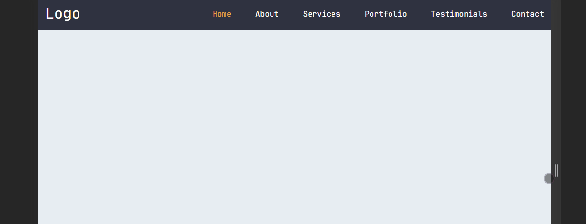

# Responsive Navigation Bar

This is a just simple project that use **HTML**, **CSS** and a little of **JavaScript**.

Also there's a responsive mode with the creation of a mini button to represent the menu.

### Preview:

