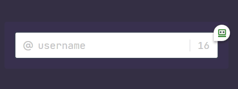

# Limit Input

This is a just simple project that use **HTML**, **CSS** a bit of **JavaScript**.

Here we have a simple input that's have a limit of 16 characters, and when we write,
the count decreases.

### Preview:

